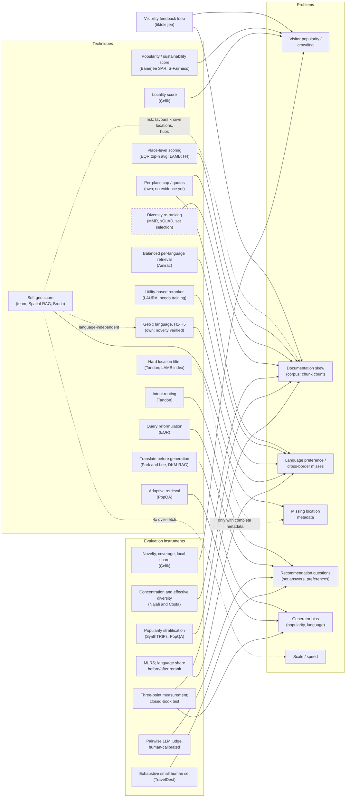

# Consolidation v2, 2026-10-06

Where the literature scan stands, how
the concepts connect, what the hypotheses' novelty verdicts are, what the proxy
data can and cannot support until December, and what comes next.
Basis: ~18 source cards, the novelty check of 2026-10-06, the team's docs.
Judgments are `[claude]` unless tagged otherwise. The Andreev card (read in a
separate chat) is not reflected here; add it where it changes a cell.

**What changed since v1:** documentation-skew techniques found at the level of
families; language debiasing covered at all three pipeline stages; evaluation
for recommendation questions filled in; novelty verdicts on H1–H6; a new risk
(the geo score can create its own concentration); reading phase closed.

---

## 1. Coverage: desired vs retrieved

**Strong** = several assessed sources; **partial** = something usable, gaps
remain; **thin** = one source or only unread candidates; **parked** = thin by
choice.

| domain problem | problem knowledge | techniques | evaluation | benchmarks |
|---|---|---|---|---|
| Documentation skew / popularity | **strong**: Najafi & Costa, Banerjee 2025, SynthTRIPs, Çelik, PopQA, survey | **partial, families identified**: post-processing only; per-place cap, place-level scoring (EQR top-n average), xQuAD/MMR (mixed evidence in RAG); none tested on chunk-count skew | **strong**: concentration, stratification, novelty/coverage/local share, three-point measurement; no standard exposure metric for RAG answers | **partial**: SynthTRIPs, TravelDest (city level) |
| Language / cross-border | **strong**: Park & Lee, Amiraz, All Languages Matter | **covered per stage**: retriever quota (training-free), reranker LAURA (needs training), generator translation; geo × language only in own hypotheses (novelty verified) | **strong**: MLRS, language share before/after rerank, citation language | **thin**: BORDIRLINES (political; deferred) |
| Location / missing metadata | **strong** `[docs]` | **good enough for now**: soft score (team), LAMB; MGeo, GeoBloom deferred (training or complete metadata) | **thin**: candidate pool size; new risk: geo score concentration, to measure in both directions | **partial**: TourismQA, POI-QA |
| Recommendation-style questions | **strong**: TourismQA, SynthTRIPs, Tandon, EQR | **partial**: intent routing, query reformulation (EQR) | **strong**: pairwise per-dimension LLM judge with human calibration; exhaustive small human set (TravelDest); constraint satisfaction + Gini (Collab-Rec) | **strong**: TourismQA, SynthTRIPs, TravelDest |
| Generator bias | **partial**: Park & Lee, Najafi & Costa, Linguistic Nepotism (via novelty check) | **thin**: DKM-RAG | **partial**: citation language | **parked** |
| Scale / speed | **thin** | **parked** (GeoBloom: lightweight, fast; store-side out of scope) | **thin**: `store_share` | **parked** |

**Remaining gaps**, all better closed by experiments than by reading:

1. **A per-place cap or place-level scoring against chunk-count skew** has no
   published evidence.
2. **An exposure metric for RAG answers** (which places an answer names)
   doesn't exist; ours to define.
3. **Whether the geo score reduces or creates concentration** in this setting.
4. **An open visitor signal for small European places**, only if T10 chooses
   crowding.

---

## 2. Concept map

Arrows from techniques and instruments point to the problem they address or
measure. Dashed nodes: deferred or known only second-hand. Dashed edges:
conditional, hypothetical or a risk.

**Framing that sits above the map:** availability (named-place questions) vs
selection (open questions). Most techniques above target selection.

---

## 3. Hypotheses and novelty verdicts

From the novelty check (targeted, not systematic; "none found" is weaker than
a full review).

| hyp. | idea | verdict | applied value |
|---|---|---|---|
| H1 | Geo score counteracts language bias for nearby other-language pages | none found | testable now with a cross-border probe |
| H2 | Language quota only for languages spoken near the anchor | none found (BORDIRLINES closest) | cheap extension of Amiraz's quota |
| H3 | Location-first, language-blind candidate pool | partial | mechanism exists; measure language bias with it |
| H4 | Place as retrieval unit across languages | partial | place-level scoring also targets documentation skew |
| H5 | Location decides what gets translated | none found | low priority: translation adds little for dense retrieval |
| H6 | Location score reduces concentration on famous places | prior work in recommenders, mixed; none in RAG | measure in both directions; geo may favour known locations |

**Test pairs:** neighbouring languages are already retrieved better, so
Slovenian–Croatian may show little gap. Include Slovenian–German (Austrian
cluster) and Slovenian–Hungarian (Hungarian cluster) [src: novelty check].

---

## 4. What the proxy data can and cannot support until December

Facts from `decisions.md` and the eval code `[docs]`; implications `[claude]`.

**Can support:**

- **Cross-border experiments.** 10 localities in 8 countries: a Croatian
  cluster 35 km from Brestanica, Austrian and Hungarian clusters, two Czech
  clusters 8 km apart.
- **Multilingual experiments.** 8 corpus languages; a `crosslingual` question
  type already exists.
- **Missing-metadata experiments.** 690 of 1,338 pages are located.
- **Measuring documentation skew** (pages and chunks per place), and place-level
  metrics for located pages, which carry a Wikidata ID.
- **Testing evaluation instruments** end to end, before the real data arrives.

**Cannot support:**

- **Recommendation-style questions.** Every question is factual, generated
  from one chunk, with one gold chunk.
- **A real popularity contrast.** All localities are small; possibly no
  genuinely famous place to contrast with. To check.
- **Labels beyond Brestanica.** Approved labels cover only the 176 original pages.
- **Human judgments.** No question has been reviewed by a person.
- **Speed at scale.** 1,338 pages say little about 300K documents.
- **Real user language.** Generated questions reuse the gold chunk's wording.

---

## 5. Low-hanging improvements

Purpose: get the instruments working before December, not to optimize on the
proxy. Ordered by effort within each group.

**Measurements first**

| improvement | effort | source |
|---|---|---|
| Documentation skew in the corpus: pages and chunks per located place | 30 min | Pepe's concern |
| Unlocated-page audit: sample unlocated pages; not a place vs too obscure to locate | 1 h | geo-score risk |
| Language share of hybrid top-30 vs reranked top-10 | small | All Languages Matter |
| Re-slice existing per-question results by documentation level and language match | small | PopQA, Park & Lee |
| Closed-book test: gpt-oss:20b on questions about the localities | small | PopQA; T9 |
| Place-level metrics over top-k: concentration, effective diversity, coverage, with and without the geo score | small | Najafi & Costa; H6 |
| MLRS language preference | medium (translation model) | Park & Lee |

**Questions and gold answers**

| improvement | effort | source |
|---|---|---|
| Cross-border probe: 10–30 hand-written questions; Croatian, German and Hungarian gold pages | small | H1; test pairs |
| Shared question set across chunkings (the team's own proposed fix) | small | team reports; Qu |
| Spatial set questions from metadata ("castles within 30 km of X"; gold from page locations and types) | small–medium | GS-QA idea; TourismQA |
| Small recommendation-style set: persona + place facts + filters, local LLM | medium | SynthTRIPs |
| Small exhaustive human-labelled set, also the calibration sample for any LLM judge | medium–large | TravelDest; LLM-judge paper |
| Questions for the 1,162 added pages | medium | team's planned step |

**Corpus and metadata**

| improvement | effort | source |
|---|---|---|
| Wikidata ID in chunk metadata (needed for all per-place work) | small | dependency |
| A few well-known places for a popularity contrast, via the seed pipeline | small–medium | `[claude]`; check with team |

**Cheap techniques to try against those measurements**

| technique | effort | measured by |
|---|---|---|
| Balanced per-language retrieval | small | language share; cross-border probe |
| Geo-conditioned language quota (H2) | small | cross-border probe |
| Per-place cap in the top-k | small | concentration; documentation slice |
| Place-level scoring (top-n average per place) | moderate | concentration; documentation slice |
| Documentation-volume score in the weighted sum (small weight) | small | documentation slice; concentration |
| Query reformulation for broad queries (EQR prompt, local model) | small–medium | recommendation set |

---

## 6. Deferred, with reasons

- **Dense X:** granularity technique, not urgent.
- **BORDIRLINES:** political benchmark; its metric is already noted.
- **Shift:** alternative to LAURA.
- **MGeo:** needs large-scale pre-training.
- **GeoBloom:** short POI records, assumes complete location; revisit for speed.
- **Forster et al.:** calibration needs user profiles (read via novelty check).
- **"Destination (Un)Known":** the popularity strand is saturated.
- **"Linguistic Nepotism":** generation side; problem established.
- **Scale and speed papers:** parked until the team asks.
- **Remaining Tier 2 geo papers** (Tatarstan, I-GUIDE, Hu et al., Kopanov): background for decisions already made.
- **Six further research threads** from the novelty check: better answered by experiments; thread 3 (open visitor signals) only if T10 chooses crowding.

---

## 7. Next steps

1. **Commit** hub v3 and this document; save the novelty check as a spoke;
   delete or archive `consolidation-2026-10-03.md`.
2. **Experiment proposals = the team update.** Problem packages (language and
   cross-border; documentation skew and selection; recommendation questions and
   evaluation), each proposal with what, why, how to test, effort, and
   proxy-now vs December; plus a component × problem matrix and a dataset-tests
   section. Include T9 and T10.
3. **Run what the team picks,** measurements first.