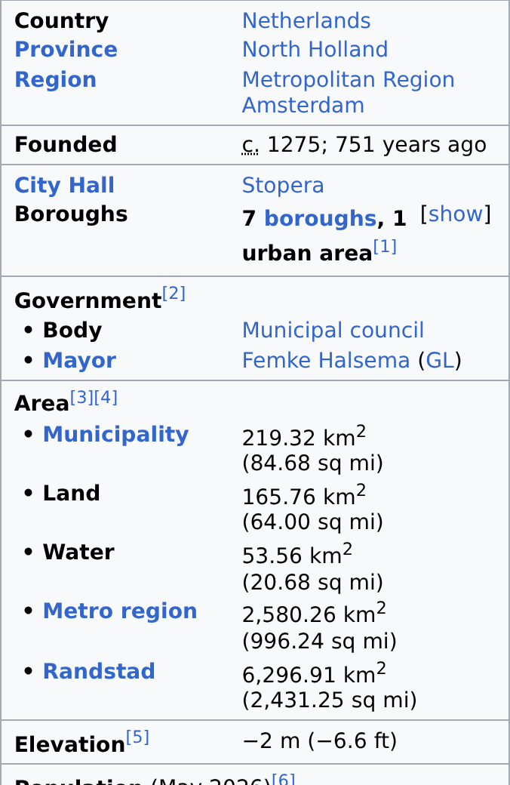
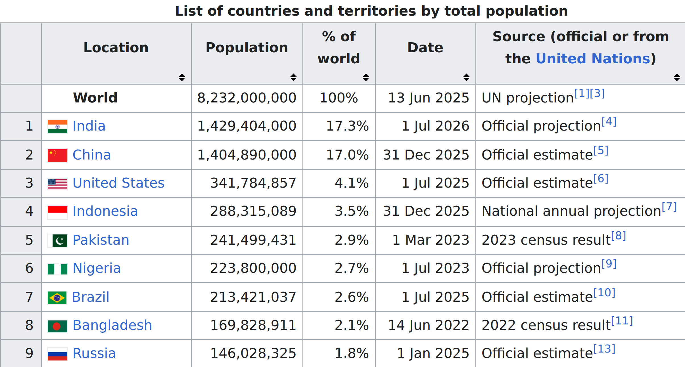
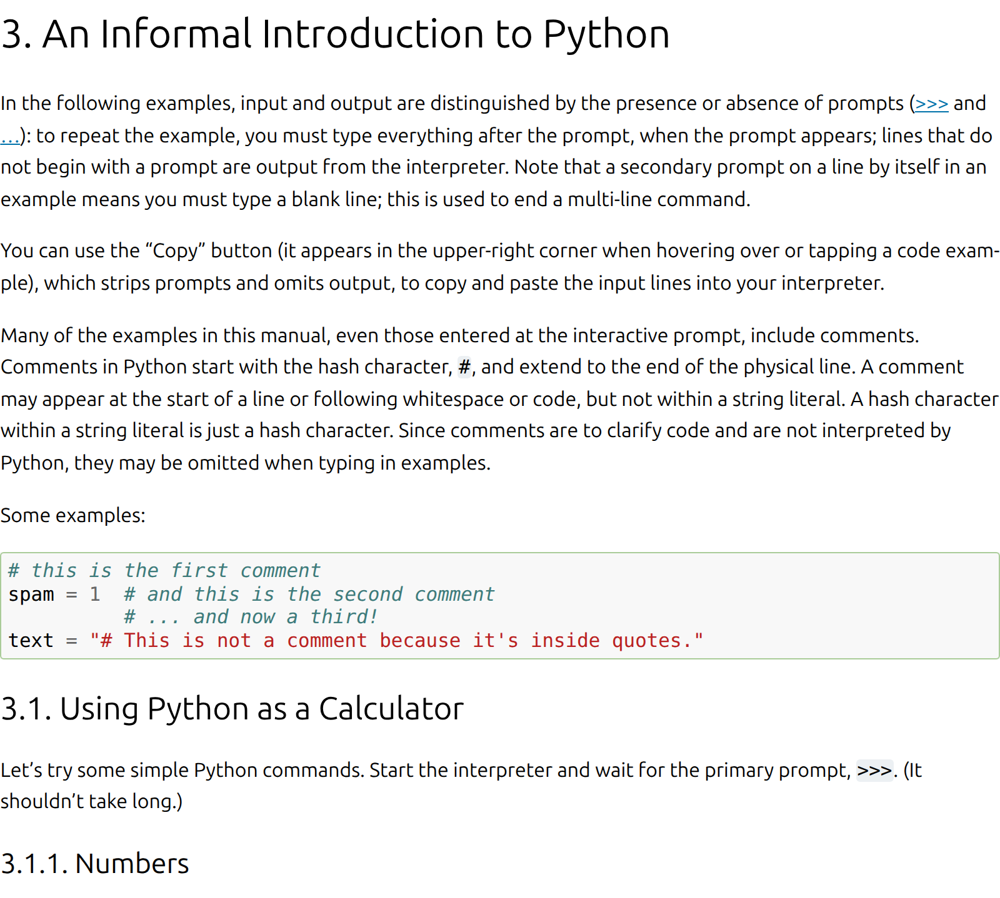

# Scraper + markdown converter

Two stages, A/B tested.

Handout version. The presented deck is <code>deck.html</code> —
same evidence, the reviewer's slide order.

  
httpx

  
→

  
trafilatura

  
→

  
markdown

---

## ① We compared scrapers

Same URL, four clients. Do they return the **same text**?

<h3>httpx</h3>reference

<h3>Scrapy</h3>100%byte-identical

<h3>Scrapling</h3>54%byte-identical

<h3>+ stealth</h3>45%byte-identical

Byte-identical markdown. On <em>content</em> — token cosine, i.e.
whether a converter would see the same document — Scrapling is 100% and stealth
98.2%, which is the figure the presented deck shows. Only the browser fetch moves
the content; Scrapling only moves the bytes.

---

## How Scrapling differs

It drops whitespace-only nodes, so citations **fuse into words**:

<h3>httpx</h3><code>…engine.[1][2] She was…</code>

<h3>Scrapling</h3><code>…engine.[1][2]She was…</code>

 

<h3 class="tight">299</h3>fused boundaries

<h3 class="tight">36</h3>pages affected

<h3 class="tight">2</h3>infoboxes destroyed

---

## ② So we picked the fetcher

<h3>Rejected</h3>Scrapling — changes the text Stealth — changes it more

<h3>Dropped as redundant</h3>Scrapy — <b>100% byte match</b> nothing left to test

<h3>Chosen</h3><b>httpx</b> what we already ship

 

Byte-identical candidates tell you nothing. We stopped testing them.

---

## Before any votes: how different are they?

Word-for-word similarity, every pair. **The fetchers barely differ at all.**

| | avg chars/page | same words as httpx | byte-identical |
|---|---:|---:|---:|
| httpx | 61 454 | — | — |
| Scrapy | 61 454 | 100% | **100%** |
| Scrapling | 61 432 | 100% | 54% |
| + stealth | 61 538 | 98% | 45% |

Same words, different bytes. Cosine alone would have called all four
interchangeable; byte-identity alone would have called them all different. The gap
between the two columns <i>is</i> the citation defect.

---

## The converters split into two families

Same HTML in. **13× spread** in output length, and the similarity matrix has two blocks.

<h3>Content models</h3>
<code>ours · trafilatura · resiliparse justext · html-text · goose3</code> 
13k–70k chars agree with each other 73–97%

<h3>Document converters</h3>
<code>crawl4ai · scrapling-md markitdown · docling</code> 
112k–180k chars agree with each other 83–99%

 

Across the divide they share **44–71%** of their words — not a ranking difference,
a different document.

<b>markitdown is 98.6% the same text as scrapling-md</b>, the
"keep everything" floor we planted in the field on purpose. That verdict needed no votes.

---

## ③ Then, fetcher fixed, we A/B tested converters

Every converter got **byte-identical HTML**. Blind pairwise votes.

  
one page

  
→

  
A

  
B

  
→

  
vote

**9 converters · 100 pages · 161 votes · 2 juries** (human + LLM panel, never mixed)

---

## What we valued

<h3>① Data & tables</h3>Did it <b>find</b> the data? Did the table stay a <b>table</b>?

<h3>② Markdown</h3>Headings, lists, tables so nothing else has to convert

<h3>③ No junk</h3>No menus, cookie banners, bare URLs, stray characters

 

Not a strict order — a missing table can be outweighed by markdown
that helps across a whole long document.

---

## ④ The leaderboard

| # | converter | Elo | 95% CI |
|---|---|---:|---|
| 1 | readability-lxml | 1652 | 1450–1834 |
| **2** | **trafilatura** | **1612** | **1489–1732** |
| 3 | resiliparse@rendered | 1606 | 1420–1778 |
| 4 | ours@raw-only | 1581 | 1490–1673 |

Human jury. The LLM panel also put trafilatura 2nd. <b>All intervals overlap</b> — the top group is not separated.

---

## Why trafilatura, not the #1

<h3>readability-lxml</h3>emits <b>HTML</b> markdown would be <b>ours</b> to build and own

<h3>trafilatura</h3>emits <b>markdown natively</b> statistically tied, one less layer

 

Nothing in the votes separates them. We broke the tie on **ownership**.

---

## Speed, per page

 <b>fetch — 1058 ms</b>  
 ours — 269 ms 
 trafilatura — 174 ms 
 resiliparse — 9 ms

 

Fetching dominates 4×. **The converter is not a speed decision.**

The one that is: **don't render.** Playwright costs **3178 ms**, and never won a vote.

---

## Our wrapper vs stock trafilatura

<h3>89 of 97 pages</h3>byte-identical the fallback never fires

<h3>8 pages differ</h3>7 are <b>listing pages</b> homepages, news indexes

 

<h3>stock — 311 chars</h3>one unrelated radio blurb

<h3>ours — 7 479 chars</h3>title + the whole linked index

rtve.es/noticias/ — and on two pages stock emitted <b>more</b> characters, all of it furniture. Length is not coverage.

---
<!-- _class: cols -->

## Example ① — the infobox

<pre>
| Country     | Netherlands             |
| Province    | North Holland           |
| Region      | Metropolitan Region A.  |
| Founded     | c. 1275                 |
| City Hall   | Stopera                 |
| • Body      | Municipal council       |
| • Mayor     | Femke Halsema (GL)      |
| • Land      | 165.76 km2 (64.00 sq mi)|
| • Water     | 53.56 km2 (20.68 sq mi) |
| • Metro     | 2,580.26 km2            |
| Elevation   | −2 m (−6.6 ft)          |
</pre>

The floating side box becomes a key/value table. 22 of 24 rows well-formed.

---
<!-- _class: cols wide -->

## Example ② — a data table

<pre>
| Location      | Population    | %     | Date        |
|---|---|---|---|
| World         | 8,232,000,000 | 100%  | 13 Jun 2025 |
| India         | 1,429,404,000 | 17.3% | 1 Jul 2026  |
| China         | 1,404,890,000 | 17.0% | 31 Dec 2025 |
| United States |   341,784,857 |  4.1% | 1 Jul 2025  |
| Indonesia     |   288,315,089 |  3.5% | 31 Dec 2025 |
| Pakistan      |   241,499,431 |  2.9% | 1 Mar 2023  |
| Nigeria       |   223,800,000 |  2.7% | 1 Jul 2023  |
</pre>

243 rows survive as rows. Plain-text converters flatten this into prose.

---
<!-- _class: cols -->

## Example ③ — not a wiki page

<pre>
# 3. An Informal Introduction to Python

Comments in Python start with the hash
character, `#`, and extend to the end of
the physical line.

Some examples:

    # this is the first comment
    spam = 1  # and this is the second
    # ... and now a third!

## 3.1. Using Python as a Calculator
</pre>

docs.python.org — headings, inline code and code blocks all intact.

---

## Where we cut corners ✂️

- **100 pages**, not thousands
- **161 votes over 66 possible pairs** — ~1.5 each.
  No two converters are separated at 95% confidence
- **Never measured our own consistency** — no re-labelling replicate
- **Speed on one machine, single-threaded** — Scrapy's real strength untested
- **crawl4ai, markitdown, docling** — never benchmarked

 

Enough to make a defensible choice. Not enough to certify one.

---

## Locked in

  
httpx no browser

  
→

  
trafilatura + fallback ladder

  
→

  
markdown

<h3>1328 ms</h3>per page

<h3>native markdown</h3>tables · headings · lists

<h3>+95 ms</h3>buys the listing pages

