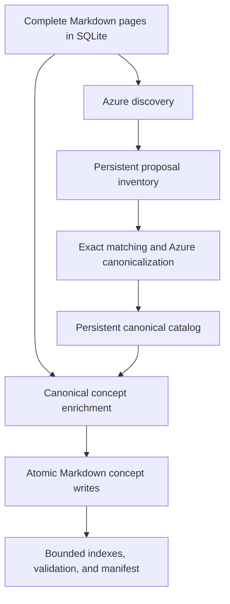

# Open Knowledge Format

Generates and consumes an OKF v0.1 tourism bundle from complete scraped pages.
Unlike normal RAG, OKF generation and navigation never read `page_chunks`.

## Architecture and inputs

The canonical input is `data/db/pages.db`. The read-only source adapter loads
successful, non-empty rows from `page_metadata`, complete Markdown from
`page_markdown_content`, and source language metadata from `page_sources`.
Every selected row becomes a source page containing its ID, source, URL, title,
language, and complete Markdown. Optional source and page-limit filters are
applied before generation.



Generation reads `page_metadata` and `page_markdown_content` from the canonical
SQLite database in read-only mode. It runs three resumable phases:

1. Azure proposes one conservative primary concept and aliases per complete page.
2. Exact matching and batched Azure resolution merge proposals into one global
	canonical catalog, seeded from concepts already in the durable bundle.
3. Azure enriches each fixed canonical concept from every assigned complete
	page; Python merges provenance, aliases, languages, tags, and citations.

Discovery produces discriminative descriptions and multilingual search terms.
When proposals resolve to an existing concept, Python retains their aliases,
tags, search terms, and alternate titles instead of dropping that routing
metadata. Enrichment additionally extracts source summaries, atomic facts, and
natural-language retrieval queries. Python stores these per page and rebuilds a
durable `# Source evidence by page` section, so later concept rewrites cannot
silently summarize away small names, dates, quantities, or relationships.

The private inventory, catalog, and enrichment checkpoint live under
`.local/okf/` and can be resumed safely. Pages above 60,000 characters are
split at Markdown headings and paragraph boundaries into parts of at most
45,000 characters. Part-level discovery is consolidated back to one page
concept, and enrichment evidence is merged under the original page ID; no page
tail is silently truncated.

Required environment variables:

- `AZURE_AI_ENDPOINT`
- `AZURE_AI_API_KEY`
- `AZURE_AI_MODEL`

Runtime policy is defined in `config.yaml`. Important defaults are a 60,000
character source-page split threshold, 45,000-character target parts, a
180-second Azure timeout, 8,192 output tokens, and three structured-output
attempts. `generate_bundle()` loads the local `.env`; credentials are never
written to documents, indexes, manifests, or checkpoints, and exact API-key
occurrences are redacted before failures are persisted.

Run a pilot and then resume across the full corpus:

```bash
just okf-pilot
just okf-generate
just okf-refresh-retrieval
just okf-validate
just okf-ask What is Rajhenburg Castle?
```

Generated concepts are written to `data/okf/tourism/`. The manifest reports
discovery, resolution, enrichment, coverage, failures, model deployment,
concept count, and validation findings. Secrets are never written to the bundle
or checkpoint.

Use `just okf-refresh-retrieval` after upgrading an older bundle. It reuses the
durable discovery inventory and canonical page assignments but re-runs
enrichment so every assigned page receives atomic facts, source summaries, and
retrieval queries. `--force` remains the clean, more expensive option that also
repeats discovery and global canonicalization.

Refresh progress lives independently in `.local/okf/retrieval-refresh.json` and
resumes across interruptions, including from the last successful part of an
oversized page. Refresh calls retain the existing concept body and request only
retrieval metadata. Detailed final Azure HTTP, JSON, or validation errors are
stored after retries, while merged metadata is bounded to prevent context growth.

## Generation phases

### Discovery and splitting

Discovery asks Azure for one conservative primary concept per source page:
stable concept ID, semantic type, title, discriminative description, tags,
aliases, and multilingual search terms. Concept IDs must have at least two
lowercase path components, cannot use traversal or reserved names, and must
resolve inside the bundle.

Pages above the configured threshold are split at Markdown headings and
paragraph boundaries. Only oversized individual blocks fall back to newline,
sentence, whitespace, and hard character boundaries. Each part is discovered
separately, then consolidated into one page proposal. Enrichment processes all
parts under the same source-page and concept identity, and part-level progress
is checkpointed so successful parts are not repeated.

### Global canonicalization

Proposals are resolved before documents are written. Python first performs
conservative normalized title/alias and type matching. Remaining proposals are
resolved in Azure batches against the global catalog, which includes prior
batches and durable concepts already in the bundle. Every page must be assigned
exactly once. Equivalent translated proposals may reuse one concept, while
independently meaningful entities remain separate. Aliases, tags, alternate
titles, and search terms are merged deterministically into the selected concept.

### Enrichment and deterministic evidence

Azure enriches each fixed concept from every assigned complete page. It returns
the final title and description, tags, aliases, search terms, realistic
retrieval questions, a source-specific summary, atomic facts, and structured
Markdown. During retrieval refresh, the existing body is retained and only
metadata is requested.

Python owns the durable merge. It de-duplicates provenance and metadata,
retains the original concept type, caps accumulated search terms, retrieval
questions, and facts, and stores each page's title, source, URL, language,
summary, facts, search terms, and retrieval questions under
`source_evidence[page_id]`. It then rebuilds `# Source evidence by page` and
`# Citations` deterministically, preventing later concept rewrites from
silently dropping small facts or source URLs.

Concept and checkpoint writes use a temporary sibling, flush and `fsync`, then
atomically replace the target. Interrupted runs therefore retain the previous
complete document. Normal runs skip successfully completed pages; `--force`
reprocesses selected pages but intentionally does not delete the existing
bundle or orphaned concepts.

## Indexes, validation, and manifest

After enrichment, indexes are regenerated from deepest directories upward.
Entries contain concept titles and discriminative descriptions; large
collections are split into bounded browse indexes. Validation requires
parseable YAML frontmatter, type, title, description, timestamp, and a non-empty
body. Links escaping the bundle are errors; missing internal targets are
warnings because evolving OKF bundles may be incomplete.

The generated `manifest.json` records the source database, selection filters,
processed/resumed/covered pages, failures, concept and retrieval-metadata
counts, Azure deployment, and validation findings. It is operational metadata,
not a credential store.

For a new unsplit page, generation normally requires discovery and enrichment
plus a share of a batched canonicalization request. An initial run over $N$
pages is therefore approximately

$$
2N + \left\lceil \frac{U}{B} \right\rceil
$$

requests before retries, where $U$ is the number of proposals not resolved by
exact matching and $B$ is the resolution batch size. Multipart pages require
one discovery and enrichment request per part plus consolidation.

The answer command starts at the root index and asks Azure for one structured
navigation action at a time. It may open only advertised paths (plus an explicit
metadata shortlist in `okf_search`), reads selected concepts in full, and
enforces step/document/context budgets. A separate structured evidence check
must confirm direct support before an answer is accepted; rejected answers
trigger backtracking. Every action and evidence decision is retained as a
diagnostic trace.

`okf` remains the pure hierarchy baseline. `okf_search` ranks title,
description, aliases, tags, generated search terms, and language with local
BM25-style scoring, then opens whole concepts. Source pages within visited
concepts are ordered from concept relevance and per-source metadata instead of
frontmatter order. Large generated collections are split at 20 links per browse
index, while index descriptions expose representative titles and keywords.

The comparison runner enables `retrieval_ready_only` for both OKF variants. A
source page is eligible only when its `source_evidence` contains atomic facts or
retrieval questions. Enrichment failures are excluded from both the evaluation
question set and returned page rankings.

For a fair comparison with chunk RAG, measure clean and incremental build cost,
online latency and context use, page-level evidence retrieval, and blinded
answer quality separately. Concept IDs are not chunk qrels. The complete
protocol is in [`experiments/indexing/README.md`](../../experiments/indexing/README.md).

## Tests and limitations

Run focused checks with:

```bash
uv run --extra dev pytest tests/test_okf.py
uv run --extra dev ruff format src/okf tests/test_okf.py
uv run --extra dev ruff check src/okf tests/test_okf.py
```

Current limitations include one primary concept per page, model-assisted
semantic canonicalization, prompt-enforced preservation of narrative prose,
source-level rather than claim-level attribution, no destructive orphan
pruning, and a combined prompt that can still grow when many pages enrich one
concept. The bundle remains portable Markdown that can be inspected in Git or
consumed without the Azure generation runtime.
